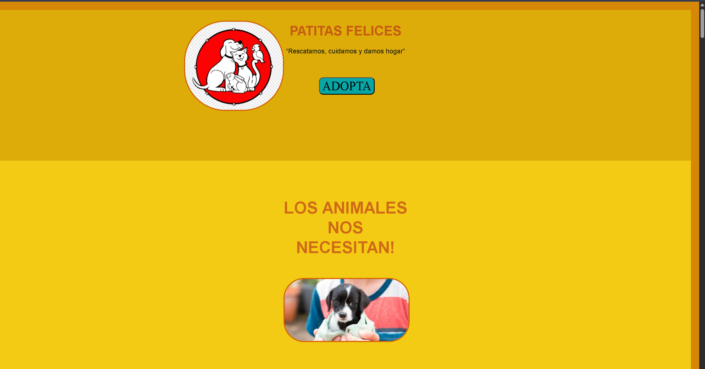
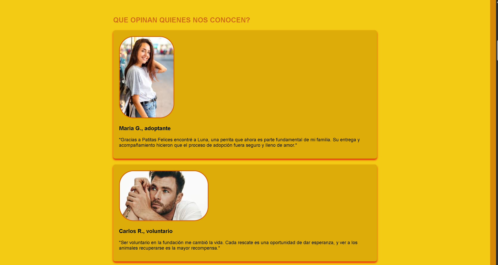
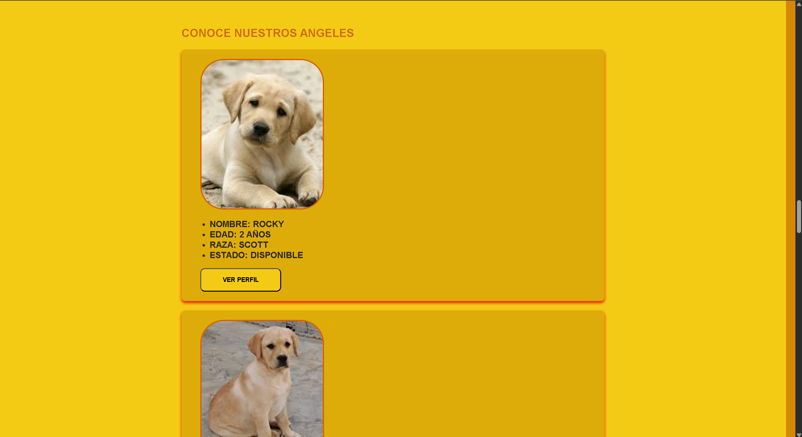
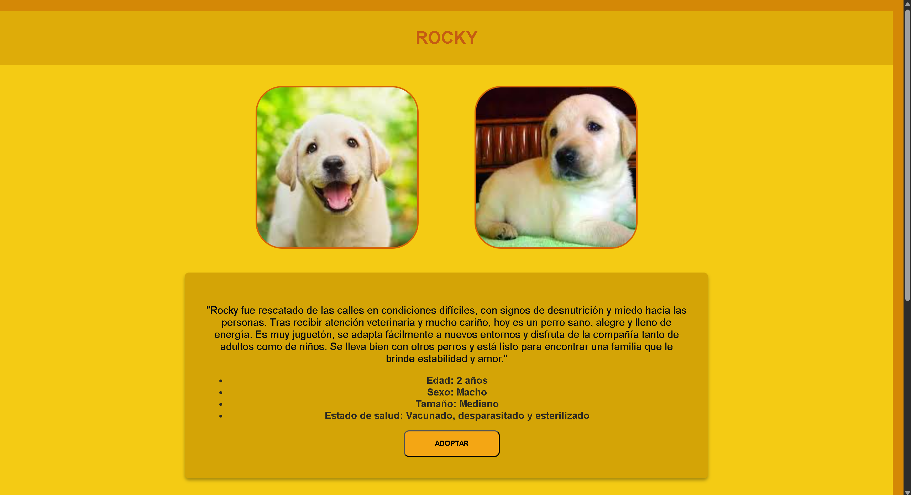
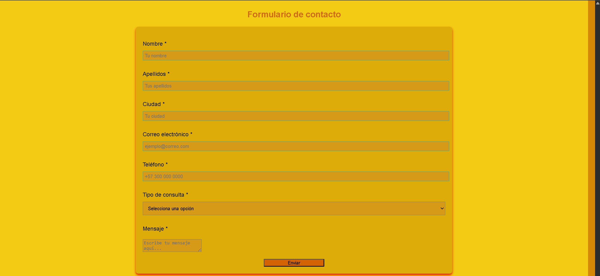

# Patitas Felices 🐾

## Descripción del proyecto

**Patitas Felices** es un sitio web desarrollado en HTML5 y CSS3 con el propósito de promover la adopción responsable de animales rescatados.

La plataforma simula el funcionamiento de una fundación animal, mostrando información institucional, testimonios, misión, visión y un catálogo de mascotas disponibles para adopción.

El proyecto incluye una página principal interactiva y páginas individuales para cada mascota, donde se presenta información detallada como historia, edad, estado de salud y características principales.

La interfaz fue diseñada con un estilo visual cálido y amigable, incorporando animaciones, carruseles automáticos y diseño responsive para mejorar la experiencia del usuario tanto en computadores como en dispositivos móviles.

---

# Funcionalidades principales

- Página principal informativa de la fundación.
- Carruseles automáticos de imágenes.
- Animaciones CSS en:
  - Botones
  - Imágenes
  - Textos
  - Secciones
- Catálogo de animales disponibles para adopción.
- Páginas individuales para cada mascota.
- Formulario de contacto interactivo.
- Diseño responsive adaptable a:
  - Tablets
  - Celulares
  - Pantallas de escritorio
- Enlaces a redes sociales.
- Navegación interna mediante anclas (`#`).

---

# Tecnologías utilizadas

- HTML5
- CSS3
- Flexbox
- Media Queries
- Animaciones con `@keyframes`

---

# Estructura del proyecto

```plaintext
Patitas-Felices/
│
├── index.html
├── style-patitas.css
│
├── rocky.html
├── max.html
├── luna.html
├── nieve.html
├── bella.html
├── tigre.html
├── copito.html
├── canela.html
├── chispa.html
│
├── style-nieve.css
├── style-rocky.css
├── style-max.css
├── ...
│
├── imagenes/
│   ├── logof.png
│   ├── c 1.jpg
│   ├── c 2.jpg
│   ├── persa 1.jpg
│   ├── persa 2.jpg
│   ├── ...
│
└── README.md
```

---

# Secciones de la página principal

## Inicio

Contiene:

- Nombre de la fundación.
- Eslogan.
- Carrusel principal.
- Descripción de la labor de la fundación.
  - Contacto


Explica:

- Objetivos de la organización.
- Compromiso con el bienestar animal.
- Impacto social esperado.

Incluye carruseles con imágenes de rescates y adopciones.

---

## Adopciones

Presenta mascotas disponibles mediante tarjetas con:

- Imagen
- Nombre
- Edad
- Raza
- Estado de adopción

Cada animal tiene un botón:

```html
<a href="nieve.html">
```

Que dirige a una página individual con información más detallada.

---

## Contactos

Incluye:

- Formulario de contacto.
- Tipos de consulta.
- Redes sociales.
- Correo y teléfono de contacto.

---

# Página individual de mascotas

Cada mascota cuenta con una página propia donde se muestra:

- Fotografías adicionales.
- Historia del animal.
- Edad.
- Sexo.
- Tamaño.
- Estado de salud.
- Botón de adopción.
- Carrusel de animales similares.

Ejemplo:

```plaintext
nieve.html
```

La mascota “Nieve” presenta una historia personalizada y un diseño enfocado en generar empatía con el usuario.

---

# Diseño y estilos CSS

## Animaciones implementadas

### Latido en botones

```css
@keyframes latir
```

Genera un efecto de crecimiento continuo al pasar el mouse.

---

### Agrandamiento de imágenes

```css
@keyframes agrandar
```

Hace zoom suavemente sobre las imágenes.

---

### Entrada lateral

```css
@keyframes entrar-derecha
```

Las secciones aparecen deslizándose desde la derecha.

---

### Aparición suave

```css
@keyframes aparecer-suave
```

Los textos aparecen progresivamente.

---

# Responsive Design

El proyecto utiliza:

```css
@media screen and (max-width: ...)
---

## Misión y visión
```

Para adaptar correctamente:

- Imágenes
- Botones

Con el objetivo de generar confianza y mostrar el impacto de la fundación.

- Encabezados
---
- Voluntarios
- Donantes
- Carruseles

Muestra opiniones de:

- Adoptantes
En dispositivos móviles y tablets.

## Testimonios


- Accesos rápidos a:
  - Donaciones
  - Voluntariado
---


# Instrucciones de ejecución

## 1. Descargar el proyecto

Clonar el repositorio:

```bash
git clone https://github.com/usuario/patitas-felices.git
```

O descargar el archivo `.zip`.

---

## 2. Abrir el proyecto

Abrir el archivo principal:

```plaintext
index.html
```

Desde cualquier navegador web.

---

## 3. Ejecutar con Visual Studio Code

### Instalar Live Server

En Visual Studio Code instalar la extensión:

```plaintext
Live Server
```

---

### Ejecutar el proyecto

1. Abrir la carpeta del proyecto.
2. Hacer clic derecho sobre:

```plaintext
index.html
```

3. Seleccionar:

```plaintext
Open with Live Server
```

---

# Objetivo académico del proyecto

Este proyecto fue desarrollado con fines educativos para aplicar conocimientos de:

- Maquetación web.
- Estilización avanzada con CSS.
- Responsive Design.
- Animaciones web.
- Organización de contenido visual.
- Navegación entre páginas HTML.

---

# Capturas del proyecto







---

# LINK FIGMA

https://www.figma.com/design/CMhKVR9wARxBnVLEtkhV1i/Sin-t%C3%ADtulo?node-id=0-1&t=uklPT82BPdUBZmb3-1

---

# Autor

Desarrollado por Santiago Obando — 2026.
